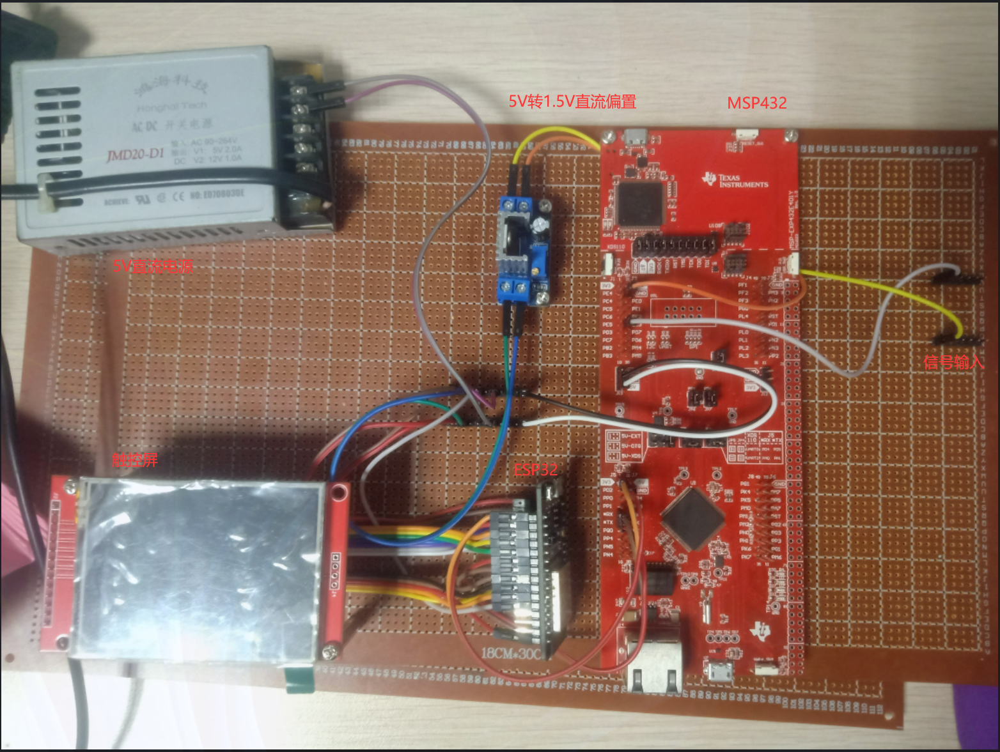

# 2021A-deweii

本文为deweii参加2021电赛A赛题`信号失真度测量装置`的准备与比赛内容归纳，比赛结果为省二。

## 01.比赛内容

题目内容不在赘述，具体结果在`2021南林A`中，下为我们的最终作品

### 功能实现

题目的要求主要可以分为：使用单片机进行高频ADC采集，数字信号处理，系统信息的显示和与手机端的数据单向通信。

我们使用`MSP432E401Y`用作ADC高频信号采集和数字信号处理；使用`ESP32DEVKIT`的蓝牙功能和手机进行蓝牙串口通信，同时通过串口和MSP432链接获取系统所需信息，并驱动一块2.8寸的电阻触摸屏以进行交互和显示。

屏幕内容为：显示测量结果并绘制波形；改变测量计算的频率并采集；蓝牙串口发送信息至手机端。

### 思路

2021A题中关于失真度的计算与2020E题一致，不同在于此题测量对象是频率变化的信号。在2020E中固定的频率下，我们可以通过固定的延时得到固定的时间内已知数量个采样点，近而进行最基础的傅里叶变换(FT)，得到各次谐波分量。但是在2021A中，如果继续使用FT方法，则在计算失真度之前我们需要先测量出信号的频率，由于我们水平不足，本作品存在缺陷(无法直接测量出频率)，后续介绍。(正确的思路是利用快速傅里叶变换(FFT)，在2022届的相关毕业论文中有更好介绍，自行索要)

此外，由于2021A要求必须使用TI公司的MCU，所以我们没有进行更多选型，直接使用老师那参数相对最好的`MSP432E401Y`。同时因为日常中对于此款MCU缺乏训练，在比赛的过程中我们的程序是基于相对方便的`TIRTOS`框架(丧失了更多底层的设置)，使用`CCS`软件进行MPS432代码设计和调试(调试功能重要，可以直接进行变量和运算进度观察)。

本人平时对于ESP32的一些基本功能比较熟悉，同时其开发过程比较简单、生态较好。对于题目中的显示和手机通信要求，ESP32驱动一块2.8寸的电阻触摸屏同时与手机进行蓝牙串口通信可以充分满足需求。ESP32的开发采用`VSCode+PlatformIO`方式。屏幕UI部分为使用库绘制的(个人审美)，如果觉得内容比较冗余复杂的话可以选择[串口屏](https://s.taobao.com/search?q=%E4%B8%B2%E5%8F%A3%E5%B1%8F)。

手机端功能使用的是huawei应用市场的一款蓝牙调试助手app(渠道唯一)，因为赛前并没有安卓软件开发的经验，所以选择它，能够方便地实现蓝牙串口的图形化显示。

### 优化(伪)

本作品中限制输出时间的并不是信号处理的算法。(而是BUG的采样时间)

对于精度问题，我们先是将采集到的信号进行观察，发现是有很大波动的，所以想着滤波会不会更好，但结果从图形上看滤波后确实更加好看，但是失真度的精度并没有更好。
另一方面，在输入高频信号值非常小的时候，显然MSP423自身的12位ADC已经误差较大，但是我们当时没能设计出可行的高频放大器，所以依然采用直连的方式，误差在最极端(100KHz 30mVpp)情况时常超出3%要求。

因为我们的信号波形显示并不是在MSP432上，需要串口通信在ESP32上进行显示，所以我们采用传输重要参数，利用谐波分量和频率进行绘制波形。

### 作品存在的缺陷

在MPS432的[myTask.c](02.%E5%B7%A5%E7%A8%8B%E6%96%87%E4%BB%B6/2021A-MSP432/src/myTask.c)中line98可以看到`usleep(1); //weird`，这里是我在比赛中写出的一个"BUG"(高采样率，长采样时间)。因为在反复的测试后，加上这句延时后ADC的采样率接近14Mhz(仅在当时的板子上，甚至超过官方标注的最大采样率(笑)，有待考证)，(常规方法在TIRTOS框架里难以达到较高的采样速度)所以后续的采样都是建立在这个BUG上的，所以我认为**本作品中采样部分和数字信号处理部分的内容大无参考价值**。

也是因为特殊的采样方式和简单的FT算法，所以在程序中我加入了频率参数，便于外部调节(比赛过程中，评委并未指出，但个人不建议)。

同时，为了满足题目的时间要求，在作品的方法下，需要对于低频做特殊的处理(即不适用BUG直接正常定时器延时采样)

## 02.工程文件

具体软件的安装和使用请自行百度。

MPS423使用`CCS`，`TIRTOS`框架，在具体的文件中，我做了一些简单的标注，如有错误见谅。

ESP32使用`VSCode+PlatformIO`，`Arduino`框架，test文件里包含了一些简单模块的训练和常用库的使用(不全面)。

手机软件中的程序并未留档。

工程文件中包含屏幕的资料，想要在别的MCU平台使用的话可以自行移植。

日常学习我的建议是 程序编写在`VScode`中进行，编译和调试在使用更具体的软件(比如Keil，本文中的CCS)
